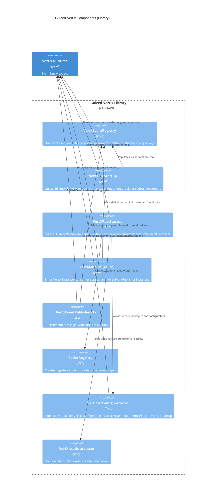

# C4 Component — Runtime Integration (Guiced-Vert.x)

```mermaid
C4Component
    title Guiced-Vert.x Components (Library)
    Container_Boundary(lib, "Guiced-Vert.x Library") {
        Component(registry, "VertxEventRegistry", "Java", "Discovers event definitions, stores consumer/publisher metadata and type keys")
        Component(prestart, "VertXPreStartup", "Java", "GuicedEE lifecycle hook to boot Vert.x, scan annotations, register codecs/consumers")
        Component(poststart, "VertXPostStartup", "Java", "GuicedEE lifecycle hook to deploy verticles and run configurators; sets static VertX accessor")
        Component(module, "VertXModule (Guice)", "Java", "Binds Vert.x instance, consumer classes, and VertxEventPublisher instances")
        Component(publisher, "VertxEventPublisher<T>", "Java", "Publish/send messages with codec resolution")
        Component(codec, "CodecRegistry", "Java", "Creates/registers codecs for discovered event types")
        Component(spi, "Verticle/Configurator SPI", "Java", "Extensible hooks for Vert.x configuration (resolver/event bus/metrics/fs) and verticle startup")
        Component(accessor, "VertX static accessor", "Java", "Holds singleton Vertx reference for late callers")
    }

    Container(ext_vertx, "Vert.x Runtime", "Java", "Event bus + codecs")

    Rel(prestart, registry, "Populates via annotation scan")
    Rel(prestart, codec, "Requests codec creation/registration")
    Rel(prestart, ext_vertx, "Boots Vert.x instance with configurator options")
    Rel(module, ext_vertx, "Provides Vert.x instance into Guice")
    Rel(module, registry, "Reads definitions to bind consumers/publishers")
    Rel(poststart, spi, "Invokes verticle deployers and configurators")
    Rel(poststart, ext_vertx, "Deploys verticles after injector is ready")
    Rel(poststart, accessor, "Sets static Vertx reference for late access")
    Rel(publisher, ext_vertx, "Publish/send messages using codecs")
    Rel(publisher, registry, "Uses type keys/options for address and codecs")
    Rel(spi, ext_vertx, "Allows tuning of event bus/cluster/metrics options")
```
