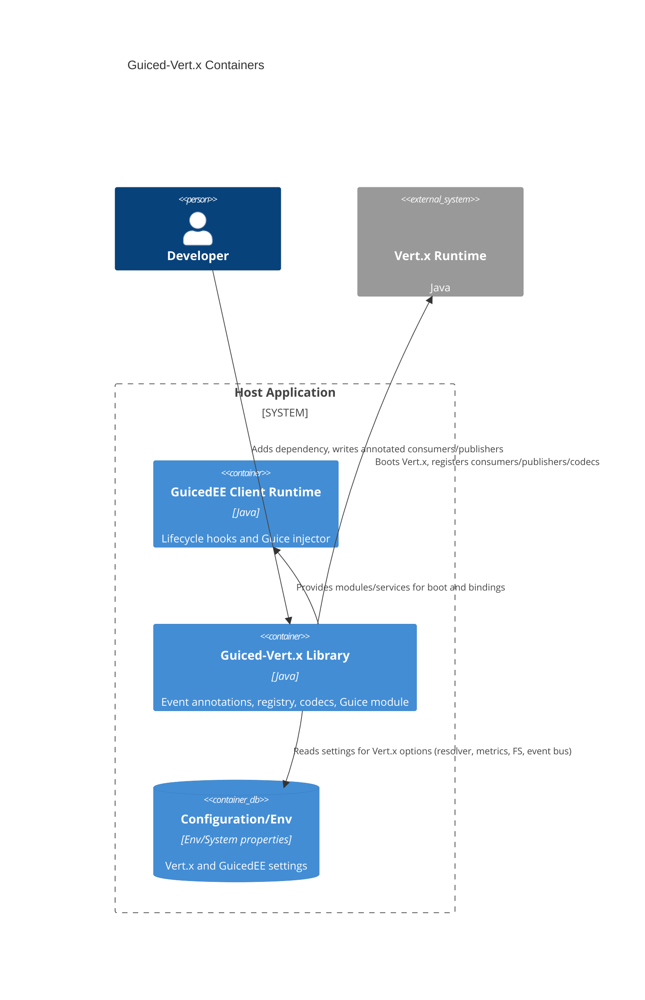

# C4 Container — Guiced-Vert.x

```mermaid
C4Container
    title Guiced-Vert.x Containers
    Person(dev, "Developer")

    System_Boundary(app, "Host Application") {
        Container(guicedee, "GuicedEE Client Runtime", "Java", "Lifecycle hooks and Guice injector")
        Container(guicedvertx, "Guiced-Vert.x Library", "Java", "Event annotations, registry, codecs, Guice module")
        ContainerDb(config, "Configuration/Env", "Env/System properties", "Vert.x and GuicedEE settings")
    }

    System_Ext(vertx, "Vert.x Runtime", "Java", "Event bus, codecs, Verticles")

    Rel(dev, guicedvertx, "Adds dependency, writes annotated consumers/publishers")
    Rel(guicedvertx, guicedee, "Provides modules/services for boot and bindings")
    Rel(guicedvertx, vertx, "Boots Vert.x, registers consumers/publishers/codecs")
    Rel(guicedvertx, config, "Reads settings for Vert.x options (resolver, metrics, FS, event bus)")
```
