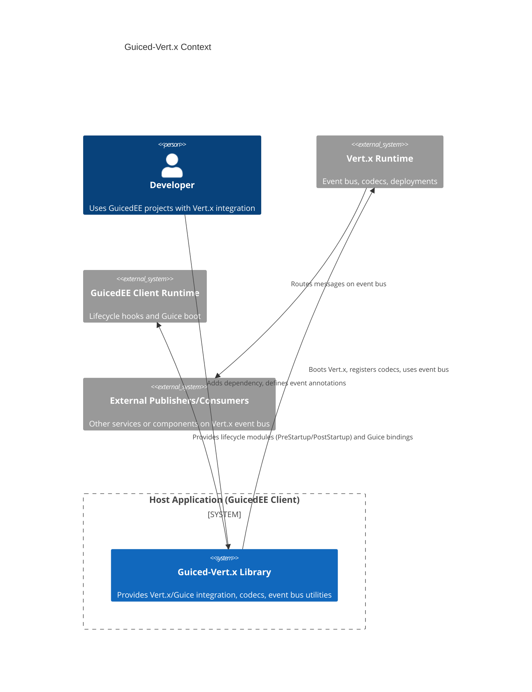

# C4 Context — Guiced-Vert.x

```mermaid
C4Context
    title Guiced-Vert.x Context
    Person(dev, "Developer", "Uses GuicedEE projects with Vert.x integration")
    System_Boundary(sys, "Host Application (GuicedEE Client)") {
        System(guicedvertx, "Guiced-Vert.x Library", "Provides Vert.x/Guice integration, codecs, event bus utilities")
    }
    System_Ext(vertx, "Vert.x Runtime", "Event bus, codecs, deployments")
    System_Ext(guicedee, "GuicedEE Client Runtime", "Lifecycle hooks and Guice boot")
    System_Ext(extern, "External Publishers/Consumers", "Other services or components on Vert.x event bus")

    Rel(dev, guicedvertx, "Adds dependency, defines event annotations")
    Rel(guicedvertx, vertx, "Boots Vert.x, registers codecs, uses event bus")
    Rel(guicedvertx, guicedee, "Provides lifecycle modules (PreStartup/PostStartup) and Guice bindings")
    Rel(vertx, extern, "Routes messages on event bus")
```
