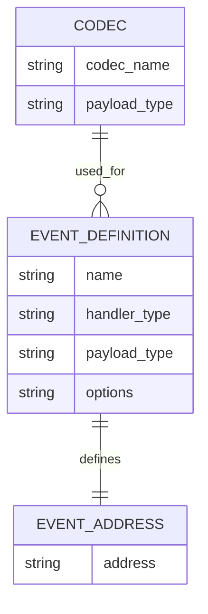

# ERD — Event Model (Logical)

```mermaid
erDiagram
    EVENT_DEFINITION ||--|| EVENT_ADDRESS : defines
    CODEC ||--o{ EVENT_DEFINITION : used_for

    EVENT_DEFINITION {
        string name
        string handler_type
        string payload_type
        string options
    }

    EVENT_ADDRESS {
        string address
    }

    CODEC {
        string codec_name
        string payload_type
    }
```

Note: No persistent datastore is used; this ERD represents in-memory metadata derived from annotations and registry structures.
