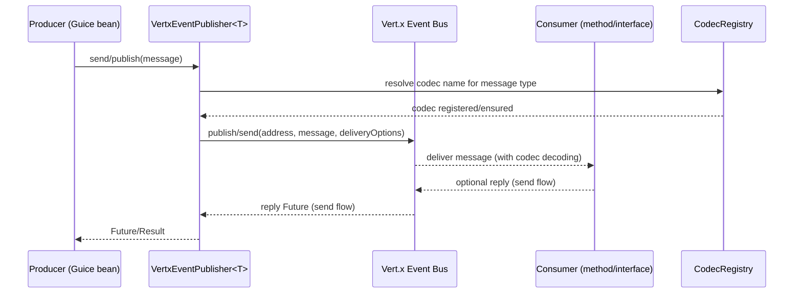

# Sequence — Publish and Consume

```mermaid
sequenceDiagram
    participant Pub as Producer (Guice bean)
    participant VEP as VertxEventPublisher<T>
    participant Vertx as Vert.x Event Bus
    participant Con as Consumer (method/interface)
    participant Codec as CodecRegistry

    Pub->>VEP: send/publish(message)
    VEP->>Codec: resolve codec name for message type
    Codec-->>VEP: codec registered/ensured
    VEP->>Vertx: publish/send(address, message, deliveryOptions)
    Vertx-->>Con: deliver message (with codec decoding)
    Con-->>Vertx: optional reply (send flow)
    Vertx-->>VEP: reply Future (send flow)
    VEP-->>Pub: Future/Result
```
