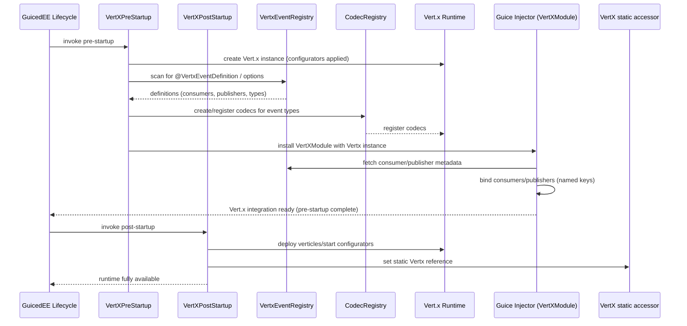

# Sequence — Startup Lifecycle

```mermaid
sequenceDiagram
    participant GEE as GuicedEE Lifecycle
    participant Pre as VertXPreStartup
    participant Post as VertXPostStartup
    participant Reg as VertxEventRegistry
    participant Codec as CodecRegistry
    participant Vertx as Vert.x Runtime
    participant Guice as Guice Injector (VertXModule)
    participant Access as VertX static accessor

    GEE->>Pre: invoke pre-startup
    Pre->>Vertx: create Vert.x instance (configurators applied)
    Pre->>Reg: scan for @VertxEventDefinition / options
    Reg-->>Pre: definitions (consumers, publishers, types)
    Pre->>Codec: create/register codecs for event types
    Codec-->>Vertx: register codecs
    Pre->>Guice: install VertXModule with Vertx instance
    Guice->>Reg: fetch consumer/publisher metadata
    Guice->>Guice: bind consumers/publishers (named keys)
    Guice-->>GEE: Vert.x integration ready (pre-startup complete)
    GEE->>Post: invoke post-startup
    Post->>Vertx: deploy verticles/start configurators
    Post->>Access: set static Vertx reference
    Post-->>GEE: runtime fully available
```
